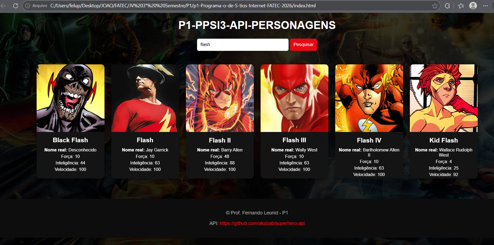

# 🚀 Projeto Front-End – Consumo de API com JavaScript

Este projeto foi desenvolvido como parte da disciplina de **Programação de Sítios Internet** - FATEC.

## 🎯 Objetivo

Criar uma aplicação web utilizando **JavaScript puro (Vanilla JS)** para consumir dados de uma **API pública**, exibindo os resultados de forma dinâmica em uma interface amigável.

---

## 💡 Funcionalidades

- Campo de busca por nome
- Consumo de API com `fetch()`
- Exibição de resultados em formato de cards
- Manipulação do DOM
- Tratamento de erros
- Interface organizada e responsiva

---

## 🛠️ Tecnologias Utilizadas

- HTML
- CSS
- JavaScript (Vanilla JS)

---

## 🔗 Acesse o Projeto
- 💻 GitHub: [https://github.com/joaolucas2007/p1-Programa-o-de-S-tios-Internet-FATEC-2026]
- 🌐 GitHub Pages: [https://joaolucas2007.github.io/p1-Programa-o-de-S-tios-Internet-FATEC-2026/]
- link da API : [href="https://github.com/akabab/superhero-api]
- Link Linkedin : [https://www.linkedin.com/posts/jo%C3%A3o-lucas-freire-da-silva-67bab0388_fiz-um-site-html-css-e-js-usando-uma-api-activity-7451043463015407616-DRd1?utm_source=share&utm_medium=member_desktop&rcm=ACoAAF-O9r8BygsC8BLzSdE9w3rGbg9JIkCc2S0]

---

## 📚 Sobre o Projeto

A aplicação permite buscar personagens em uma API pública e exibir suas informações de forma dinâmica, reforçando conceitos fundamentais de desenvolvimento front-end como:

- Requisições HTTP
- Manipulação de elementos HTML via JavaScript
- Interatividade com o usuário

---

## 📸 Preview

---

## 📢 Post no LinkedIn

Confira a publicação sobre este projeto:

👉 [https://www.linkedin.com/posts/jo%C3%A3o-lucas-freire-da-silva-67bab0388_fiz-um-site-html-css-e-js-usando-uma-api-activity-7451043463015407616-DRd1?utm_source=share&utm_medium=member_desktop&rcm=ACoAAF-O9r8BygsC8BLzSdE9w3rGbg9JIkCc2S0]

---

## 👨‍🏫 Disciplina

**Programação de Sítios Internet**  
Prof. Fernando Leonid – 2026

---

## Entrega
- Nome do aluno: João Lucas Freire da Silva 3 ° Semestre
- Link do git hub: [https://github.com/joaolucas2007/p1-Programa-o-de-S-tios-Internet-FATEC-2026]
- Link do git pages : [https://joaolucas2007.github.io/p1-Programa-o-de-S-tios-Internet-FATEC-2026/]
- Link do linkedin : [https://www.linkedin.com/posts/jo%C3%A3o-lucas-freire-da-silva-67bab0388_fiz-um-site-html-css-e-js-usando-uma-api-activity-7451043463015407616-DRd1?utm_source=share&utm_medium=member_desktop&rcm=ACoAAF-O9r8BygsC8BLzSdE9w3rGbg9JIkCc2S0]

## Critérios
* [x] Foi criado o campo de busca? (0,5)
* [x] Os cards são criados dinamicamente? (1,5)
* [x] Os cards são criados dependendo da busca? (1,5)
* [x] Foi utilizado métodos para criar os novos elementos HTML? (1,5)
* [x] O consumo de API foi feito usando o `fetch()`? (1,5)
* [x] Incluiu tratamento de erro no campo de busca? (0,5)
* [x] Está responsivo? (1,0)
* [x] Foi criado o README com informações do projeto? (1,0)
* [x] Foi habilitado o github Pages? (0,5)
* [x] Foi publicado no linkedIn? (0,5)
